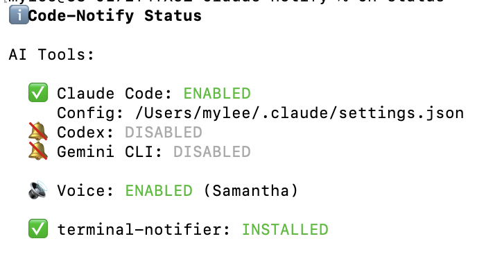
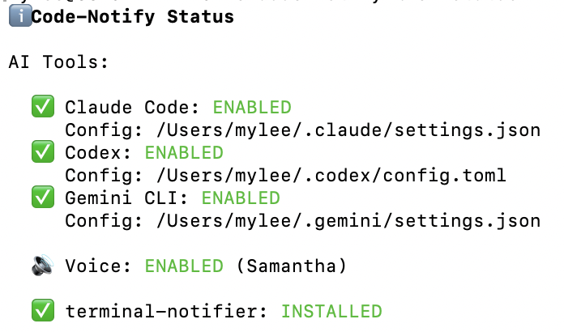
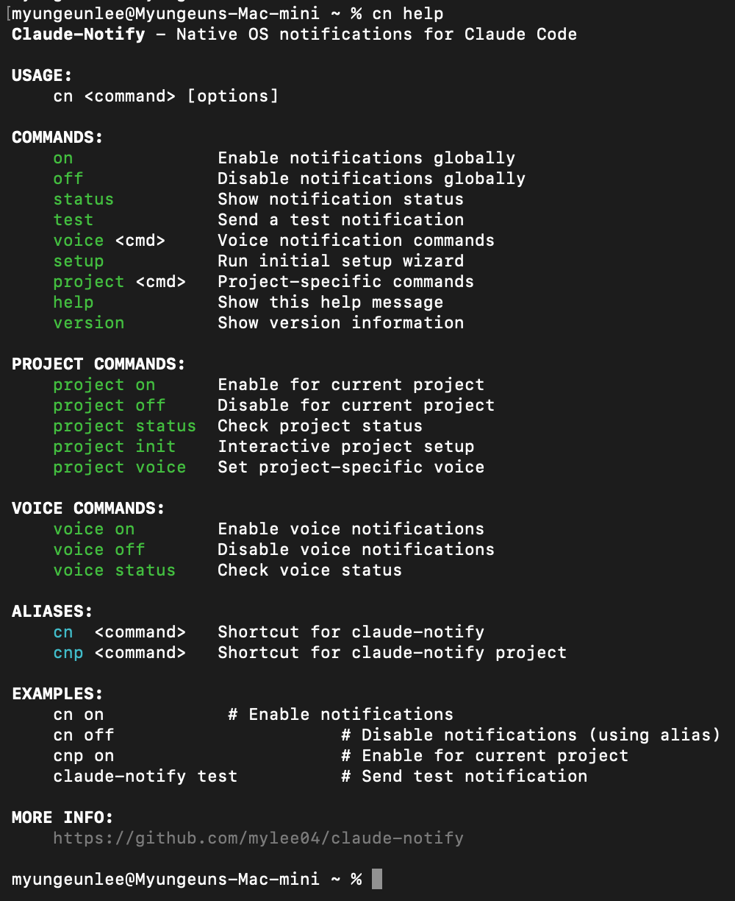
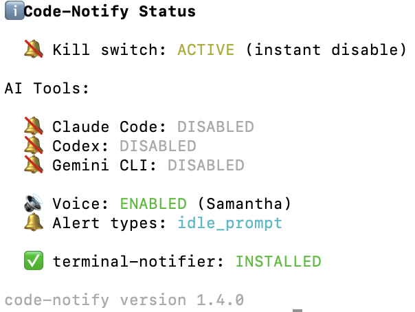

# Code-Notify

> **Official downloads**: https://github.com/mylee04/code-notify/releases
>
> **Homebrew**: `brew install mylee04/tools/code-notify`

Desktop notifications for AI coding tools - get alerts when tasks complete or input is needed.

<p>
  
  
</p>

[](https://github.com/mylee04/code-notify/releases)
[](https://opensource.org/licenses/MIT)
[](https://www.apple.com/macos)
[](https://www.linux.org/)
[](https://www.microsoft.com/windows)

## Features

- **Multi-tool support** - Claude Code, OpenAI Codex, Google Gemini CLI
- **Works everywhere** - Terminal, VSCode, Cursor, or any editor
- **Cross-platform** - macOS, Linux, Windows
- **Native notifications** - Uses system notification APIs
- **Voice announcements** - Hear when tasks complete (macOS, Windows)
- **Tool-specific messages** - "Claude completed the task", "Codex completed the task"
- **Project-specific settings** - Different configs per project
- **Quick aliases** - `cn` and `cnp` for fast access

## Installation

### For Humans

**macOS (Homebrew)**
```bash
brew tap mylee04/tools
brew install code-notify
cn on
```

**Linux / WSL**
```bash
curl -sSL https://raw.githubusercontent.com/mylee04/code-notify/main/scripts/install.sh | bash
```

**Windows**
```powershell
irm https://raw.githubusercontent.com/mylee04/code-notify/main/scripts/install-windows.ps1 | iex
```

### For LLM Agents

Paste this to your AI agent (Claude Code, Cursor, etc.):

```
Install code-notify by following:
https://raw.githubusercontent.com/mylee04/code-notify/main/docs/installation.md
```

Or fetch directly:
```bash
curl -s https://raw.githubusercontent.com/mylee04/code-notify/main/docs/installation.md
```

## Usage



| Command | Description |
|---------|-------------|
| `cn on` | Enable notifications for all detected tools |
| `cn on claude` | Enable for Claude Code only |
| `cn on codex` | Enable for Codex only |
| `cn on gemini` | Enable for Gemini CLI only |
| `cn off` | Disable notifications |
| `cn test` | Send test notification |
| `cn status` | Show current status |
| `cn alerts` | Configure which events trigger notifications |
| `cn voice on` | Enable voice (macOS, Windows) |
| `cn voice on claude` | Enable voice for Claude only |
| `cnp on` | Enable for current project only |

## How It Works

Code-Notify uses the hook systems built into AI coding tools:

- **Claude Code**: `~/.claude/settings.json`
- **Codex**: `~/.codex/config.toml`
- **Gemini CLI**: `~/.gemini/settings.json`

When enabled, it adds hooks that call the notification script when tasks complete:

```json
{
  "hooks": {
    "Stop": [{ "matcher": "", "hooks": [{ "type": "command", "command": "notify.sh stop claude" }] }],
    "Notification": [{ "matcher": "idle_prompt", "hooks": [{ "type": "command", "command": "notify.sh notification claude" }] }]
  }
}
```

### Alert Types



By default, notifications only fire when the AI is idle and waiting for input (`idle_prompt`). You can customize this:

```bash
cn alerts                          # Show current config
cn alerts add permission_prompt    # Also notify on tool permission requests
cn alerts remove permission_prompt # Remove permission notifications
cn alerts reset                    # Back to default (idle_prompt only)
```

| Type | Description |
|------|-------------|
| `idle_prompt` | AI is waiting for your input (default) |
| `permission_prompt` | AI needs tool permission (Y/n) |
| `auth_success` | Authentication success |
| `elicitation_dialog` | MCP tool input needed |

## Troubleshooting

**Command not found?**
```bash
exec $SHELL   # Reload shell
```

**No notifications?**
```bash
cn status     # Check if enabled
cn test       # Test notification
brew install terminal-notifier  # Better notifications (macOS)
```

## Project Structure

```
code-notify/
├── bin/           # Main executable
├── lib/           # Library code
├── scripts/       # Install scripts
├── docs/          # Documentation
└── assets/        # Images
```

## Links

- [Installation Guide](docs/installation.md)
- [Hook Configuration](docs/HOOKS_GUIDE.md)
- [Contributing](docs/CONTRIBUTING.md)
- [GitHub Issues](https://github.com/mylee04/code-notify/issues)

## License

MIT License - see [LICENSE](LICENSE)
