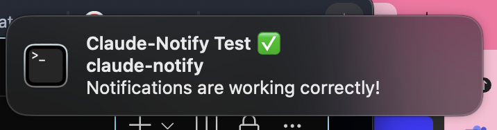
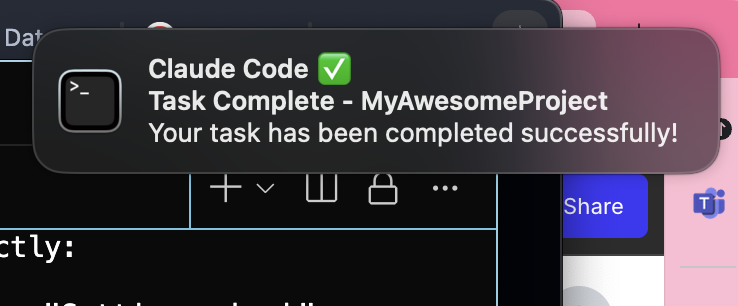
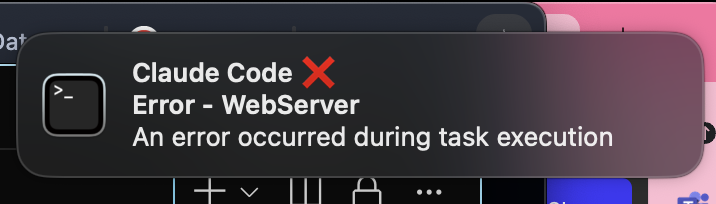

# 🔔 Claude-Notify

Cross-platform desktop notifications for Claude Code - get alerts when tasks complete, errors occur, or input is needed.



[](https://github.com/mylee04/claude-notify/releases)
[](https://brew.sh)
[](https://opensource.org/licenses/MIT)
[](https://www.apple.com/macos)
[](https://www.linux.org/)
[](https://www.microsoft.com/windows)

## ✨ Features

- 🚀 **Cross-platform support** for macOS, Linux, and Windows
- 🔔 **Native desktop notifications** with platform-specific integration
- 🛡️ **NEW: Bash Command Notifications** - Get notified when Claude needs approval to run commands
- 🔊 **NEW: Voice Notifications** - Hear when tasks complete with customizable voices (macOS fully supported, basic support for Linux/Windows)
- 📦 **Multiple installation methods** (Homebrew for macOS, universal installer for others)
- 🌐 **Global notifications** for all projects
- 📁 **Project-specific settings** that override global config
- ⚡ **Quick aliases** (`cn`, `cnp`) for fast access
- 🎨 **Platform-optimized notifications**:
  - **macOS**: terminal-notifier or native osascript ✅ 
  - **Linux**: notify-send, zenity, or wall ✅
  - **Windows**: Native PowerShell toast notifications ✅
- 🔄 **Easy on/off toggle** without losing configuration
- 🛡️ **Non-invasive** - uses Claude Code's existing hook system

## 🖥️ Platform Support

| Feature | macOS | Linux | Windows |
|---------|-------|-------|---------|
| Desktop Notifications | ✅ Full | ✅ Full* | 🧪 Full** |
| Voice Notifications | ✅ Full | ⚠️ Basic*** | 🧪 Full**** |
| Installation | ✅ Homebrew | ✅ Script | 🧪 PowerShell |
| Project Settings | ✅ Full | ✅ Full | 🧪 Full |
| Quick Aliases | ✅ Full | ✅ Full | 🧪 Full |
| Native Implementation | ✅ Tested | ⚠️ Partial | 🧪 Untested |

**Legend**: ✅ = Tested & Working | ⚠️ = Basic Support | 🧪 = Experimental/Untested

\* Requires libnotify (usually pre-installed)  
\** Windows 10/11 toast notifications via PowerShell  
\*** Voice: Linux (espeak/festival - optional)  
\**** Voice: Windows SAPI with multiple voices (David, Zira, Mark)

## 📸 Screenshots

See Claude-Notify in action across different notification types:

### ✅ Task Complete


### 🔔 Input Required


### ❌ Error Notification


### 🛡️ Bash Command Approval (NEW!)
Never miss when Claude is waiting for permission to run a command!

## 🚀 Quick Start

### Install

#### macOS (Homebrew)
```bash
# Add the tap (one-time setup)
brew tap mylee04/tools

# Install claude-notify
brew install claude-notify

# Or install directly without tap:
brew install mylee04/tools/claude-notify

# Run setup (optional but recommended)
claude-notify setup
```

### Upgrade to Latest Version

**Already have claude-notify installed?** Update to get new features:

```bash
# Update Homebrew formulae
brew update

# Upgrade claude-notify to latest version
brew upgrade claude-notify

# Check your version
cn version
```

**New features not working?** You might have an older version:
```bash
# Check current version
cn version

# If it shows v1.0.x, upgrade to v1.1.0+ for:
# - Voice notifications (cn voice on)
# - settings.json support
# - Project-specific voices (cnp voice on)
brew upgrade claude-notify
```

#### Windows (PowerShell) - Experimental ⚠️
```powershell
# Download and install
git clone https://github.com/mylee04/claude-notify.git
cd claude-notify
powershell -ExecutionPolicy Bypass -File install-windows.ps1

# Or run directly from PowerShell
irm https://raw.githubusercontent.com/mylee04/claude-notify/main/install-windows.ps1 | iex
```

> **Note**: Windows support is experimental and hasn't been fully tested yet. If you're a Windows user, please [report any issues](https://github.com/mylee04/claude-notify/issues) or let me know if it works! Your feedback will help improve Windows support. 🙏

#### Linux (Bash)
```bash
# Download and run the installer
curl -sSL https://raw.githubusercontent.com/mylee04/claude-notify/main/install.sh | bash

# Or clone and install manually
git clone https://github.com/mylee04/claude-notify.git
cd claude-notify
./install.sh
```

### Notification Dependencies (Usually Pre-installed)

Claude-notify works out of the box on most systems. For the best experience:

#### macOS
```bash
# Already included on macOS (uses native notifications)
# For enhanced notifications (optional):
brew install terminal-notifier
```

#### Linux
```bash
# Most Linux desktops have this pre-installed
# If notifications don't work, install:
sudo apt-get install libnotify-bin  # Ubuntu/Debian
sudo dnf install libnotify          # Fedora
sudo pacman -S libnotify            # Arch
```

#### Windows
```powershell
# Uses built-in Windows notifications
# For enhanced notifications (optional):
Install-Module -Name BurntToast -Scope CurrentUser
```

### Enable Notifications

```bash
# Enable globally (all projects)
cn on

# Or just for current project
cnp on
```

That's it! You'll now receive notifications when Claude Code completes tasks.

## 📖 Usage

Claude-notify provides **two ways** to run every command - use whichever you prefer!

### 🎯 Understanding Global vs Project Settings

Claude-notify uses a **layered configuration system** (like CSS inheritance):

1. **Global Settings** (`cn` commands) - Your default for all projects
2. **Project Settings** (`cnp` commands) - Override global for specific projects

**How they work together:**
```bash
# Example 1: Global ON, no project config
cn on                    # ✅ All projects get notifications

# Example 2: Global OFF, specific project ON  
cn off                   # ❌ Notifications off by default
cd ~/important-project
cnp on                   # ✅ THIS project still gets notifications!

# Example 3: Different voices for different projects
cn voice on              # Set global voice to "Samantha"
cd ~/uk-client && cnp voice on    # Override with "Daniel" (he has a british accent) for this project
cd ~/fun-game && cnp voice on     # Override with "Good News" for this project
```

**Key Points:**
- Project settings OVERRIDE global settings (not disable them)
- Each project can have its own configuration
- Remove project settings with `cnp off` to use global defaults again

### Global Commands

Control notifications for all projects. **Both commands do exactly the same thing:**

```bash
# Enable notifications - choose either command:
claude-notify on          # Full command
cn on                     # Short alias (same result!)

# Disable notifications - choose either command:
claude-notify off         # Full command
cn off                    # Short alias (same result!)

# Check status - choose either command:
claude-notify status      # Full command
cn status                 # Short alias (same result!)

# Send test notification - choose either command:
claude-notify test        # Full command
cn test                   # Short alias (same result!)
```

### Project Commands

Control notifications for the current project only. **Both commands do exactly the same thing:**

```bash
# Enable for current project - choose either command:
claude-notify project on  # Full command
cnp on                    # Short alias (same result!)

# Disable for current project - choose either command:
claude-notify project off # Full command
cnp off                   # Short alias (same result!)

# Check project status - choose either command:
claude-notify project status  # Full command
cnp status                    # Short alias (same result!)

# Interactive setup - choose either command:
claude-notify project init    # Full command
cnp init                      # Short alias (same result!)
```

💡 **Tip**: Use full commands in scripts/documentation for clarity, and short aliases for quick daily use!

### How It Works

1. **Global Settings**: Stored in `~/.claude/hooks.json`
2. **Project Settings**: Stored in `.claude/hooks.json` in your project
3. **Priority**: Project settings override global settings
4. **Hooks**: Integrates with Claude Code's hook system

## 🎯 Examples

### Basic Workflow

```bash
# Enable notifications globally
cn on

# Work on a project
cd my-project

# Claude Code will now notify you when tasks complete!
```

### Project-Specific Setup

```bash
# Navigate to a project
cd my-important-project

# Enable notifications just for this project
cnp on

# This project will have notifications even if global is off
```

### Temporary Disable

```bash
# Working late? Disable notifications temporarily
cn off

# Re-enable when ready
cn on
```

## ⚙️ Configuration

### Hook System (Updated for Claude Code v2.0+)

Claude-Notify uses Claude Code's hook system via `settings.json` files:

**Global**: `~/.claude/settings.json`
```json
{
  "model": "opus",
  "hooks": {
    "Notification": [
      {
        "matcher": "",
        "hooks": [
          {
            "type": "command",
            "command": "~/.claude/notifications/notify.sh notification"
          }
        ]
      }
    ],
    "Stop": [
      {
        "matcher": "",
        "hooks": [
          {
            "type": "command",
            "command": "~/.claude/notifications/notify.sh stop"
          }
        ]
      }
    ],
    "PreToolUse": [
      {
        "matcher": "Bash",
        "hooks": [
          {
            "type": "command",
            "command": "~/.claude/notifications/notify.sh PreToolUse"
          }
        ]
      }
    ]
  }
}
```

**Project**: `.claude/settings.json` (in project root)
```json
{
  "hooks": {
    "Stop": [
      {
        "matcher": "",
        "hooks": [
          {
            "type": "command",
            "command": "~/.claude/notifications/notify.sh stop completed 'project-name'"
          }
        ]
      }
    ]
  }
}
```

> **Important Note**: Claude Code uses `settings.json` (not `hooks.json`) for hook configuration. The format is array-based with capitalized hook names. Claude-notify automatically handles this for you!

### Notification Types

- ✅ **Task Complete**: When Claude finishes a task
- 🔔 **Input Required**: When Claude needs your input
- 🛡️ **Bash Command Approval**: When Claude needs permission to run a command (NEW!)
- ❌ **Error**: When an error occurs (future feature)

## 🛠️ Advanced Usage

### 🔊 Voice Notifications (macOS)

Add audio feedback to your notifications using macOS text-to-speech:

```bash
# Enable voice notifications
cn voice on

# Choose from various voices:
# - Samantha (default)
# - Alex, Daniel, Victoria (standard voices)
# - Whisper, Good News, Bad News (novelty voices)

# Disable voice notifications
cn voice off

# Check voice status
cn voice status
```

When enabled, you'll hear:
- "Master, your task in [project] is complete"
- "Master, I need your input in [project]"
- "Master, there was an error in [project]"

**To change/switch voices anytime:**
```bash
# Currently using Whisper? Want to switch to Daniel?
cn voice on              # Just run this again!
# It will show all voices and ask "Which voice would you like?"
# Type: Daniel

# Currently using Alex? Want to switch to Oliver?  
cn voice on              # Run again!
# Type: Oliver

# Project-specific voice changes work the same way
cnp voice on             # Shows voices, pick a new one!

# Quick switch via command line (advanced):
echo "Samantha" > ~/.claude/notifications/voice-enabled    # Global
echo "Good News" > .claude/voice                           # Project
```

**Available voices to choose from:**
- **American**: Samantha, Alex, Fred, Victoria, Ava
- **British**: Daniel, Oliver, Kate, Serena
- **Other accents**: Fiona (Scottish), Moira (Irish), Karen (Australian)
- **Fun voices**: Whisper, Good News, Bad News, Bells, Bubbles

**Project-Specific Voices** (Perfect for multitasking!):
```bash
# Set a unique voice for current project
cnp voice on

# Example: Different voices for different projects
# - "Whisper" for secret-project
# - "Daniel" (British) for uk-client
# - "Good News" for fun-side-project

# Remove project voice setting
cnp voice off

# Check project voice
cnp voice status
```

### Check Detailed Status

```bash
# Verbose status with all details
cn status --verbose

# Check for updates
cn status --check-updates
```

### Custom Project Names

By default, notifications show the current directory name. Git repositories show the repository name.

### Logging

All notifications are logged to:
```
~/.claude/logs/notifications.log
```

## 🔧 Troubleshooting

### Notifications Not Appearing?

1. **Check Status**
   ```bash
   cn status
   ```

2. **Ensure terminal-notifier is installed**
   ```bash
   brew install terminal-notifier
   ```

3. **Check macOS Notification Settings**
   - System Settings → Notifications
   - Ensure Terminal has permission to send notifications

4. **Run Test**
   ```bash
   cn test
   ```

### Bash Command Notifications Not Working?

The PreToolUse hook for bash command notifications requires:
1. Claude Code to be restarted after enabling (hooks load at startup)
2. Commands that trigger approval dialogs (not all commands do)
3. Proper `settings.json` format (claude-notify handles this automatically)

**Note**: This feature depends on Claude Code's hook implementation and may vary by version.

### Command Not Found?

```bash
# Reload your shell
exec $SHELL

# Or source your shell config
source ~/.zshrc  # or ~/.bashrc
```

### Project Settings Not Working?

- Ensure you're in the project root directory
- Check for `.claude/hooks.json` in the project
- Project settings override global settings

## 🧪 Windows Testers Needed!

**Are you a Windows user?** We need your help! The Windows implementation is brand new and untested. 

Please test and report:
- ✅ What works well
- ❌ What doesn't work
- 💡 Any error messages
- 🖥️ Your Windows version (10, 11, etc.)

**How to report**: 
- [Open an issue](https://github.com/mylee04/claude-notify/issues/new?title=Windows%20Test%20Report&body=Windows%20Version:%20%0AWhat%20works:%20%0AWhat%20doesn't:%20%0AError%20messages:%20)
- Or email: myungeun2dc@gmail.com

Your feedback will make claude-notify better for all Windows users! 🙏

## 🤝 Contributing

Contributions are welcome! Please feel free to submit a Pull Request.

1. Fork the repository
2. Create your feature branch (`git checkout -b feature/amazing-feature`)
3. Commit your changes (`git commit -m 'Add amazing feature'`)
4. Push to the branch (`git push origin feature/amazing-feature`)
5. Open a Pull Request

## 📝 Development

### Local Installation

```bash
# Clone the repository
git clone https://github.com/mylee04/claude-notify.git
cd claude-notify

# Make scripts executable
chmod +x bin/claude-notify

# Add to PATH for testing
export PATH="$PWD/bin:$PATH"

# Test the commands
claude-notify version
cn status
```

### Running Tests

```bash
# Run test suite
make test

# Test Homebrew formula locally
brew install --build-from-source Formula/claude-notify.rb
```

## 🗺️ Roadmap

- [ ] Linux support (libnotify)
- [ ] Windows support (PowerShell/BurntToast)
- [ ] Custom notification sounds
- [ ] Notification history viewer
- [ ] Integration with other Claude tools
- [ ] Custom notification templates
- [ ] Do Not Disturb scheduling

## 📄 License

This project is licensed under the MIT License - see the [LICENSE](LICENSE) file for details.

## 🙏 Acknowledgments

- Built for the amazing [Claude Code](https://claude.ai/code) community
- Inspired by developer productivity tools
- Uses [terminal-notifier](https://github.com/julienXX/terminal-notifier) for notifications

## 📬 Support

- **Issues**: [GitHub Issues](https://github.com/mylee04/claude-notify/issues)
- **Discussions**: [GitHub Discussions](https://github.com/mylee04/claude-notify/discussions)
- **Email**: myungeun2dc@gmail.com

---

<p align="center">
  Made with ❤️ for developers who love Claude Code
</p>

<p align="center">
  <a href="https://github.com/mylee04/claude-notify">⭐ Star this repo</a> •
  <a href="https://github.com/mylee04/claude-notify/issues">🐛 Report Bug</a> •
  <a href="https://github.com/mylee04/claude-notify/issues">✨ Request Feature</a>
</p>