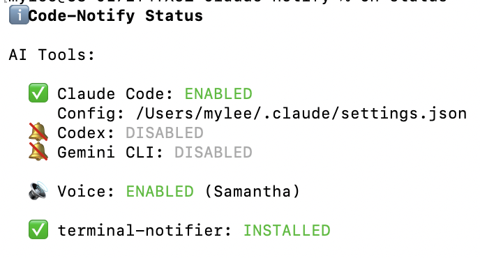
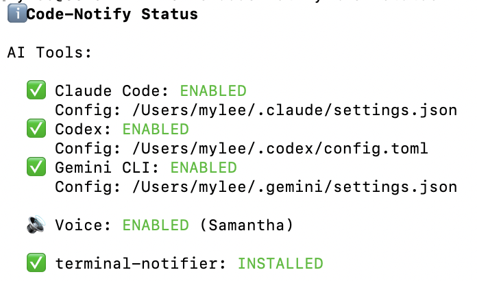
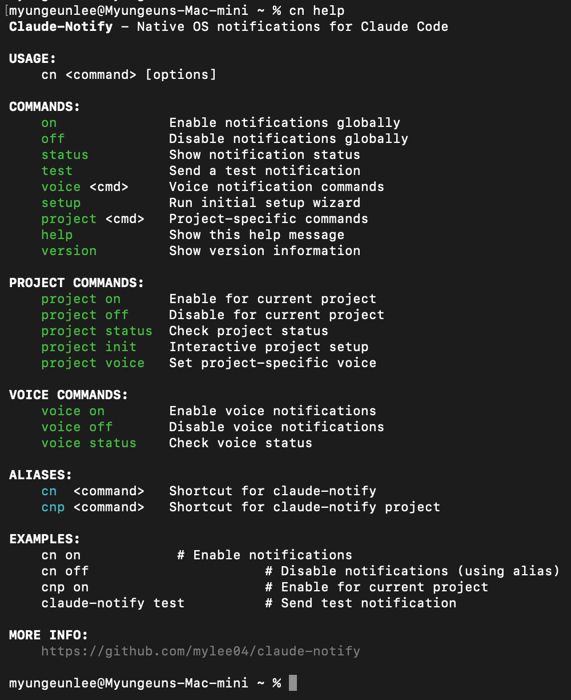
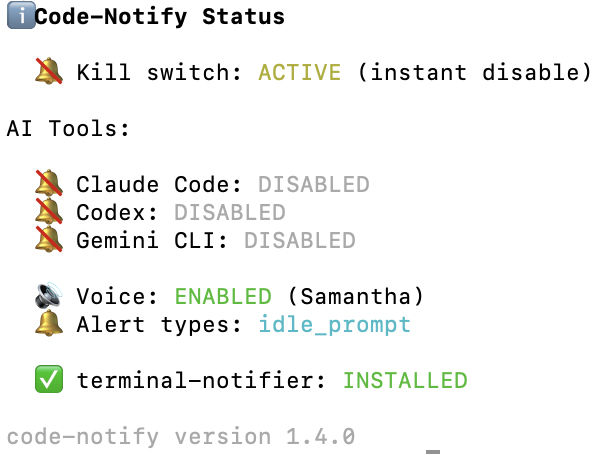

# Code-Notify

> **Official downloads**: https://github.com/mylee04/code-notify/releases
>
> **Homebrew**: `brew install mylee04/tools/code-notify`
>
> **npm**: `npm install -g code-notify`

Desktop notifications for AI coding tools - get alerts when tasks complete or input is needed.

## Latest: Advance Usage Reset Reminders

On macOS/Linux (including WSL), Code-Notify can now remind you before Codex or Claude usage resets, using the existing usage watcher and notification channels.

- **Default schedule**: Weekly reminders at 48h, 24h, 12h, 6h, 2h, and 30m; 5h windows use 2h and 30m
- **Once per reset cycle**: Full-quota observations do not erase previously sent reminders
- **Quiet catch-up**: Missed stages collapse into the most urgent reminder for each window
- **Configurable**: Choose your own schedule with `cn usage reset-reminders set 24,6,1`, or disable it with `cn usage reset-reminders off`

Update and verify the installed version:

```bash
cn update
code-notify version
```

Usage alerts remain opt-in: start with `cn usage setup --watch`. Existing enabled usage configs without a `reset_reminders` setting use the default reminder schedule. After updating, restart any running watcher with `cn usage watch restart` (include your provider and interval options if customized).

Voice samples: [Daily reset](https://cdn.jsdelivr.net/gh/mylee04/code-notify@main/assets/audio/codex-token-daily-limit-reset.m4a) · [Weekly reset](https://cdn.jsdelivr.net/gh/mylee04/code-notify@main/assets/audio/codex-token-weekly-limit-reset.m4a)


<p>
  
  
</p>

[](https://github.com/mylee04/code-notify/releases)
[](https://opensource.org/licenses/MIT)
[](https://www.apple.com/macos)
[](https://www.linux.org/)
[](https://www.microsoft.com/windows)

---

## What's New in v1.13.0

- **Advance reset reminders**: Configurable schedules based on provider-reported reset times
- **Per-cycle dedupe**: Prevent repeat reminders after a temporary return to 100% quota, while re-arming for the next reset cycle
- **Flexible timestamps**: Accept Unix seconds, milliseconds, and ISO-8601 reset times
- **Existing delivery paths**: Reuse desktop, voice, sound, Slack, and Discord without a new service or dependency

---

## Features

- **Multi-tool support** - Claude Code, OpenAI Codex, Google Gemini CLI, Oh My Pi (omp)
- **Works everywhere** - Terminal, VSCode, Cursor, or any editor
- **Cross-platform** - macOS, Linux, Windows
- **Native notifications** - Uses system notification APIs
- **macOS click-through control** - Choose which app notification clicks activate
- **Sound notifications** - Play custom sounds on task completion
- **Voice announcements** - Hear when tasks complete (macOS, Windows)
- **Slack/Discord delivery** - Mirror notifications to incoming webhooks
- **Usage alerts** - Opt-in Codex/Claude 20%, 10%, advance reset reminders, and reset notifications (macOS/Linux)
- **Tool-specific messages** - "Claude completed the task", "Codex completed the task", "omp completed the task"
- **Project-specific settings** - Different configs per project
- **Quick aliases** - `cn` and `cnp` for fast access

## Installation

### For Humans

**macOS (Homebrew)**

```bash
brew tap mylee04/tools
brew install code-notify
cn on
```

**macOS (Homebrew, Already Installed)**

```bash
cn update
code-notify version
```

If you were using the older `claude-notify` hook layout, supported upgrades now repair those Claude hooks automatically. On Windows, that repair also covers older `notify.ps1` hook layouts and alternate Claude settings locations such as `%USERPROFILE%\.config\.claude\settings.json`. Existing unrelated Claude hooks are preserved during enable/disable operations.

**Linux / WSL**

```bash
curl -sSL https://raw.githubusercontent.com/mylee04/code-notify/main/scripts/install.sh | bash
```

**npm (macOS / Linux / Windows)**

```bash
npm install -g code-notify
cn on
```

**Windows**

```powershell
irm https://raw.githubusercontent.com/mylee04/code-notify/main/scripts/install-windows.ps1 | iex
```

### For AI Coding Agents

Paste this to your AI coding agent (Claude Code, Codex, Cursor, Gemini CLI, etc.):

```
Install code-notify using npm only. Prefer npm over curl or git clone.

npm install -g code-notify
cn on all
cn test
cn status
```

Expected result:

- `cn test` shows a desktop notification.
- `cn status` shows enabled tools.

If npm is unavailable, use the fallback installer in [docs/installation.md](docs/installation.md).

Agent-friendly command block:

```bash
npm install -g code-notify
cn on all
cn test
```

npm packages are published with GitHub Actions Trusted Publisher and npm provenance. The npm `postinstall` script only performs global-install bootstrap tasks: on macOS/Linux it quietly repairs legacy Claude hook paths, and on Windows it bootstraps the local PowerShell wrapper. Set `CODE_NOTIFY_SKIP_POSTINSTALL=1` to skip those install-time helpers.

## Usage



| Command              | Description                                  |
| -------------------- | -------------------------------------------- |
| `cn on`              | Enable notifications for all detected tools  |
| `cn on all`          | Explicit alias for enabling all detected tools |
| `cn on claude`       | Enable for Claude Code only                  |
| `cn on codex`        | Enable for Codex only                        |
| `cn on gemini`       | Enable for Gemini CLI only                   |
| `cn on omp`          | Enable for Oh My Pi (omp) only               |
| `cn off`             | Disable notifications                        |
| `cn off all`         | Explicit alias for disabling all tools       |
| `cn test`            | Send test notification                       |
| `cn status`          | Show current status                          |
| `cn update`          | Update code-notify                           |
| `cn update check`    | Check the latest release and show the update command |
| `cn click-through`   | Show current macOS click-through mappings    |
| `cn click-through add <app>` | Add a macOS click-through mapping    |
| `cn alerts`          | Configure which events trigger notifications |
| `cn channels`        | Configure Slack/Discord delivery channels    |
| `cn usage`           | Configure Codex/Claude usage alerts          |
| `cn sound on`        | Enable sound notifications                   |
| `cn sound set <path>`| Use custom sound file                        |
| `cn voice on`        | Enable voice (macOS, Windows)                |
| `cn voice on claude` | Enable voice for Claude only                 |
| `cnp on`             | Enable for current project only              |

When enabling project notifications with `cnp on`, Code-Notify warns if Claude project trust does not appear to be accepted yet.
Project-scoped Claude hooks override the global mute file, so `cn off` will not suppress a project where `cnp on` is enabled.
`all` is also accepted as an explicit alias for global commands such as `cn on all`, `cn off all`, and `cn status all`.

## How It Works

Code-Notify uses the hook systems built into AI coding tools:

- **Claude Code**: `~/.claude/settings.json`
- **Codex**: `~/.codex/config.toml`
- **Gemini CLI**: `~/.gemini/settings.json`
- **Oh My Pi (omp)**: `~/.omp/agent/extensions/code-notify.js`

For Codex, Code-Notify configures `notify = ["/absolute/path/to/notifier.sh", "codex"]` and reads the JSON payload Codex appends on completion.
Codex currently exposes completion events through `notify`; approval and `request_permissions` prompts do not currently arrive through this hook.
On macOS, when a Codex session runs through T3 Code, Code-Notify uses the payload's `thread-id` to resolve the matching title from T3 Code's local state. If T3 Code is unavailable or no matching thread exists, it falls back to the workspace name.

For omp, Code-Notify writes a small managed extension module to `~/.omp/agent/extensions/code-notify.js`, because omp loads extension modules instead of reading hook commands from a config file. The extension forwards omp's `agent_end` event to the same `notifier.sh`, so sound, voice, Slack/Discord channels, click-through, the global mute switch, and rate limiting all work unchanged. Like Codex, omp currently exposes completion events; approval and idle prompts are not yet wired.

When enabled, it adds hooks that call the notification script when tasks complete:

```json
{
  "hooks": {
    "Stop": [
      {
        "matcher": "",
        "hooks": [{ "type": "command", "command": "notify.sh stop claude" }]
      }
    ],
    "Notification": [
      {
        "matcher": "idle_prompt",
        "hooks": [
          { "type": "command", "command": "notify.sh notification claude" }
        ]
      }
    ],
    "SubagentStop": [
      {
        "matcher": "",
        "hooks": [
          { "type": "command", "command": "notify.sh SubagentStop claude" }
        ]
      }
    ]
  }
}
```

### Alert Types



By default, notifications only fire when the AI is idle and waiting for input (`idle_prompt`). You can customize this:

```bash
cn alerts                          # Show current config
cn alerts add permission_prompt    # Also notify on tool permission requests
cn alerts add ask_user             # Notify immediately when Claude asks a question
cn alerts add SubagentStop         # Also notify when Claude subagents finish
cn alerts remove permission_prompt # Remove permission notifications
cn alerts reset                    # Back to default (idle_prompt only)
```

| Type                 | Description                                    |
| -------------------- | ---------------------------------------------- |
| `idle_prompt`        | AI is waiting for your input (default)         |
| `permission_prompt`  | AI needs tool permission (Y/n)                 |
| `auth_success`       | Authentication success                         |
| `elicitation_dialog` | MCP tool input needed                          |
| `ask_user`           | Claude asks a question via AskUserQuestion     |
| `SubagentStart`      | Claude subagent started                        |
| `SubagentStop`       | Claude subagent completed                      |
| `TeammateIdle`       | Claude teammate is waiting for input           |
| `TaskCreated`        | Claude agent-team task was created             |
| `TaskCompleted`      | Claude agent-team task completed               |

Alert-type matching applies to Claude Code notification hooks and Gemini CLI notification hooks. Changes are applied immediately when Claude notifications are already enabled; otherwise, run `cn on` after choosing the alert types. `ask_user` is a Claude-only `PreToolUse` hook for `AskUserQuestion`. Claude Code agent/team events are separate hook events and are opt-in via `cn alerts add SubagentStop`, `cn alerts add TeammateIdle`, or `cn alerts add TaskCompleted`.

Agent-team and subagent workflows can be noisy if `permission_prompt` is enabled. If you only want idle pings, run `cn alerts remove permission_prompt`. Codex currently uses completion events from `notify`, so `permission_prompt` and `idle_prompt` settings do not change Codex behavior.

### Slack And Discord

Code-Notify can also send the same notification to Slack or Discord through incoming webhooks. Desktop notifications still work normally; remote delivery is an extra channel.

```bash
cn channels add slack https://hooks.slack.com/services/...
cn channels add discord https://discord.com/api/webhooks/...
cn channels status
cn channels test all
```

Webhook URLs are stored locally in `~/.config/code-notify/channels.json` and are redacted in `cn status`.

### Usage Alerts

Usage alerts and advance reminders are opt-in for Codex and Claude on macOS/Linux, including WSL. Native Windows usage polling and advance reminders are not implemented yet. Fast setup:

```bash
cn usage setup --watch
cn usage status
```

That enables usage alerts, sets the default 20% and 10% warning thresholds, schedules reset reminders at 48h, 24h, 12h, 6h, 2h, and 30m, enables distinct reset voice/sound, and starts a background watcher.

Manual setup:

```bash
cn usage on                         # Enable usage alerts
cn usage thresholds set 20,10       # Warn at 20% and 10% remaining
cn usage reset-reminders set 48,24,12,6,2,0.5
cn usage reset-alerts voice on      # Speak reset alerts
cn usage reset-alerts sound default # Use the reset sound
cn usage check                      # Run one check now
cn usage watch start --interval 300 # Keep watching in the background
```

Code-Notify checks the daily (5h) and weekly (7d) usage windows. It sends a warning when remaining usage crosses 20% or 10%, advance reminders when a provider-reported reset approaches, and a reset notification when a window returns to 100%. Weekly windows use all default reminder stages; 5h windows use the 2h and 30m stages.

Each reminder stage is sent once per reset cycle. Reminders are suppressed while quota is full, without forgetting stages already sent in that cycle. If the watcher was stopped while several stages passed, Code-Notify sends only the most urgent catch-up reminder per window instead of a burst. Existing enabled usage configs without a `reset_reminders` setting use the default schedule after upgrading. Customize or disable it with:

```bash
cn usage reset-reminders set 24,6,1
cn usage reset-reminders off
cn usage reset-reminders reset
```

`cn usage check` runs once and exits. `cn usage watch start` keeps watching in the background on macOS/Linux. Use `cn usage watch stop` to stop it.

After updating Code-Notify, restart any running watcher with `cn usage watch restart` so it loads the new runtime. Include the same provider and `--interval` options if you previously customized them.

Terminal demo:

```bash
cn usage setup --watch
cn usage status
```

Reset alerts are intentionally separate from normal task-complete alerts. By default they use a different title, voice message, and reset sound so it is clear that tokens have refilled. The voice message identifies the window, for example `Codex token daily limit reset` or `Codex token weekly limit reset`. You can disable or customize that behavior:

```bash
cn usage reset-alerts off
cn usage reset-alerts voice off
cn usage reset-alerts sound set ~/sounds/tokens-reset.wav
```

Send warnings, advance reminders, and reset alerts to Slack or Discord too:

```bash
cn channels add slack https://hooks.slack.com/services/...
cn channels add discord https://discord.com/api/webhooks/...
cn channels test all
```

Codex usage checks read `~/.codex/auth.json`. Claude usage checks read `~/.claude/.credentials.json`. Code-Notify does not launch provider CLIs or start login flows. Background watching starts only when you run `cn usage setup --watch` or `cn usage watch start`.

## Troubleshooting

**Command not found?**

```bash
exec $SHELL   # Reload shell
```

**No notifications?**

```bash
cn status     # Check if enabled
cn test       # Test notification
brew install terminal-notifier  # Better notifications (macOS)
```

**Notification click opens the wrong macOS app?**

```bash
cn click-through add PhpStorm
cn test
```

**Installed with npm?**

```bash
cn update     # Runs: npm install -g code-notify@latest
```

**Too many `last_notification_*` files in `~/.claude/notifications`?**

Generated rate-limit state files are stored under `~/.claude/notifications/state/` instead of cluttering the root notifications folder.

## Project Structure

```
code-notify/
├── bin/           # Main executable
├── lib/           # Library code
├── scripts/       # Install scripts
├── docs/          # Documentation
└── assets/        # Images
```

## Links

- [Installation Guide](docs/installation.md)
- [Hook Configuration](docs/HOOKS_GUIDE.md)
- [Contributing](docs/CONTRIBUTING.md)
- [GitHub Issues](https://github.com/mylee04/code-notify/issues)

## License

MIT License - see [LICENSE](LICENSE)
