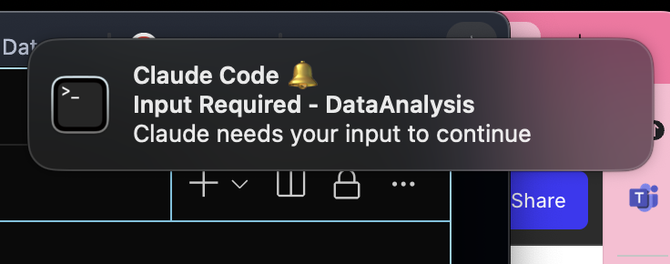

# 🔔 Claude-Notify

Cross-platform desktop notifications for Claude Code - get alerts when tasks complete, errors occur, or input is needed.


[](https://brew.sh)
[](https://opensource.org/licenses/MIT)
[](https://www.apple.com/macos)
[](https://www.linux.org/)
[](https://www.microsoft.com/windows)

## ✨ Features

- 🚀 **Cross-platform support** for macOS, Linux, and Windows
- 🔔 **Native desktop notifications** with platform-specific integration
- 📦 **Multiple installation methods** (Homebrew, manual script, package managers)
- 🌐 **Global notifications** for all projects
- 📁 **Project-specific settings** that override global config
- ⚡ **Quick aliases** (`cn`, `cnp`) for fast access
- 🎨 **Platform-optimized notifications**:
  - **macOS**: terminal-notifier or native osascript
  - **Linux**: notify-send, zenity, or wall
  - **Windows**: PowerShell with BurntToast or native notifications
- 🔄 **Easy on/off toggle** without losing configuration
- 🛡️ **Non-invasive** - uses Claude Code's existing hook system

## 📸 Screenshots

<details>
<summary>Click to see notifications in action</summary>





</details>

## 🚀 Quick Start

### Install

#### macOS (Homebrew)
```bash
# Add the tap (one-time setup)
brew tap mylee04/tools

# Install claude-notify
brew install claude-notify

# Run setup (optional but recommended)
claude-notify setup
```

#### Linux & Windows (Universal Installer)
```bash
# Download and run the installer
curl -sSL https://raw.githubusercontent.com/mylee04/claude-notify/main/install.sh | bash

# Or clone and install manually
git clone https://github.com/mylee04/claude-notify.git
cd claude-notify
./install.sh
```

### Platform-Specific Dependencies

#### macOS
```bash
# Optional but recommended
brew install terminal-notifier
```

#### Linux
```bash
# Ubuntu/Debian
sudo apt-get install libnotify-bin

# Fedora
sudo dnf install libnotify

# Arch
sudo pacman -S libnotify
```

#### Windows
```powershell
# Optional: Install BurntToast for better notifications
Install-Module -Name BurntToast -Scope CurrentUser
```

### Enable Notifications

```bash
# Enable globally (all projects)
cn on

# Or just for current project
cnp on
```

That's it! You'll now receive notifications when Claude Code completes tasks.

## 📖 Usage

### Global Commands

Use these commands to control notifications for all projects:

```bash
# Full command → Alias
claude-notify on      →  cn on       # Enable notifications
claude-notify off     →  cn off      # Disable notifications
claude-notify status  →  cn status   # Check status
claude-notify test    →  cn test     # Send test notification
```

### Project Commands

Control notifications for the current project only:

```bash
# Full command → Alias
claude-notify project on      →  cnp on      # Enable for project
claude-notify project off     →  cnp off     # Disable for project
claude-notify project status  →  cnp status  # Check project status
claude-notify project init    →  cnp init    # Interactive setup
```

### How It Works

1. **Global Settings**: Stored in `~/.claude/hooks.json`
2. **Project Settings**: Stored in `.claude/hooks.json` in your project
3. **Priority**: Project settings override global settings
4. **Hooks**: Integrates with Claude Code's hook system

## 🎯 Examples

### Basic Workflow

```bash
# Enable notifications globally
cn on

# Work on a project
cd my-project

# Claude Code will now notify you when tasks complete!
```

### Project-Specific Setup

```bash
# Navigate to a project
cd my-important-project

# Enable notifications just for this project
cnp on

# This project will have notifications even if global is off
```

### Temporary Disable

```bash
# Working late? Disable notifications temporarily
cn off

# Re-enable when ready
cn on
```

## ⚙️ Configuration

### Hook System

Claude-Notify uses Claude Code's hook system. When enabled, it creates:

**Global**: `~/.claude/hooks.json`
```json
{
  "hooks": {
    "stop": {
      "description": "Notify when Claude completes a task",
      "command": "~/.claude/notifications/notify.sh stop"
    },
    "notification": {
      "description": "Notify when Claude needs input",
      "command": "~/.claude/notifications/notify.sh notification"
    }
  }
}
```

**Project**: `.claude/hooks.json` (in project root)
```json
{
  "hooks": {
    "stop": {
      "description": "Project-specific notification",
      "command": "~/.claude/notifications/notify.sh stop completed 'project-name'"
    }
  }
}
```

### Notification Types

- ✅ **Task Complete**: When Claude finishes a task
- 🔔 **Input Required**: When Claude needs your input
- ❌ **Error**: When an error occurs (future feature)

## 🛠️ Advanced Usage

### Check Detailed Status

```bash
# Verbose status with all details
cn status --verbose

# Check for updates
cn status --check-updates
```

### Custom Project Names

By default, notifications show the current directory name. Git repositories show the repository name.

### Logging

All notifications are logged to:
```
~/.claude/logs/notifications.log
```

## 🔧 Troubleshooting

### Notifications Not Appearing?

1. **Check Status**
   ```bash
   cn status
   ```

2. **Ensure terminal-notifier is installed**
   ```bash
   brew install terminal-notifier
   ```

3. **Check macOS Notification Settings**
   - System Settings → Notifications
   - Ensure Terminal has permission to send notifications

4. **Run Test**
   ```bash
   cn test
   ```

### Command Not Found?

```bash
# Reload your shell
exec $SHELL

# Or source your shell config
source ~/.zshrc  # or ~/.bashrc
```

### Project Settings Not Working?

- Ensure you're in the project root directory
- Check for `.claude/hooks.json` in the project
- Project settings override global settings

## 🤝 Contributing

Contributions are welcome! Please feel free to submit a Pull Request.

1. Fork the repository
2. Create your feature branch (`git checkout -b feature/amazing-feature`)
3. Commit your changes (`git commit -m 'Add amazing feature'`)
4. Push to the branch (`git push origin feature/amazing-feature`)
5. Open a Pull Request

## 📝 Development

### Local Installation

```bash
# Clone the repository
git clone https://github.com/mylee04/claude-notify.git
cd claude-notify

# Make scripts executable
chmod +x bin/claude-notify

# Add to PATH for testing
export PATH="$PWD/bin:$PATH"

# Test the commands
claude-notify version
cn status
```

### Running Tests

```bash
# Run test suite
make test

# Test Homebrew formula locally
brew install --build-from-source Formula/claude-notify.rb
```

## 🗺️ Roadmap

- [ ] Linux support (libnotify)
- [ ] Windows support (PowerShell/BurntToast)
- [ ] Custom notification sounds
- [ ] Notification history viewer
- [ ] Integration with other Claude tools
- [ ] Custom notification templates
- [ ] Do Not Disturb scheduling

## 📄 License

This project is licensed under the MIT License - see the [LICENSE](LICENSE) file for details.

## 🙏 Acknowledgments

- Built for the amazing [Claude Code](https://claude.ai/code) community
- Inspired by developer productivity tools
- Uses [terminal-notifier](https://github.com/julienXX/terminal-notifier) for notifications

## 📬 Support

- **Issues**: [GitHub Issues](https://github.com/mylee04/claude-notify/issues)
- **Discussions**: [GitHub Discussions](https://github.com/mylee04/claude-notify/discussions)
- **Email**: myungeun2dc@gmail.com

---

<p align="center">
  Made with ❤️ for developers who love Claude Code
</p>

<p align="center">
  <a href="https://github.com/mylee04/claude-notify">⭐ Star this repo</a> •
  <a href="https://github.com/mylee04/claude-notify/issues">🐛 Report Bug</a> •
  <a href="https://github.com/mylee04/claude-notify/issues">✨ Request Feature</a>
</p>